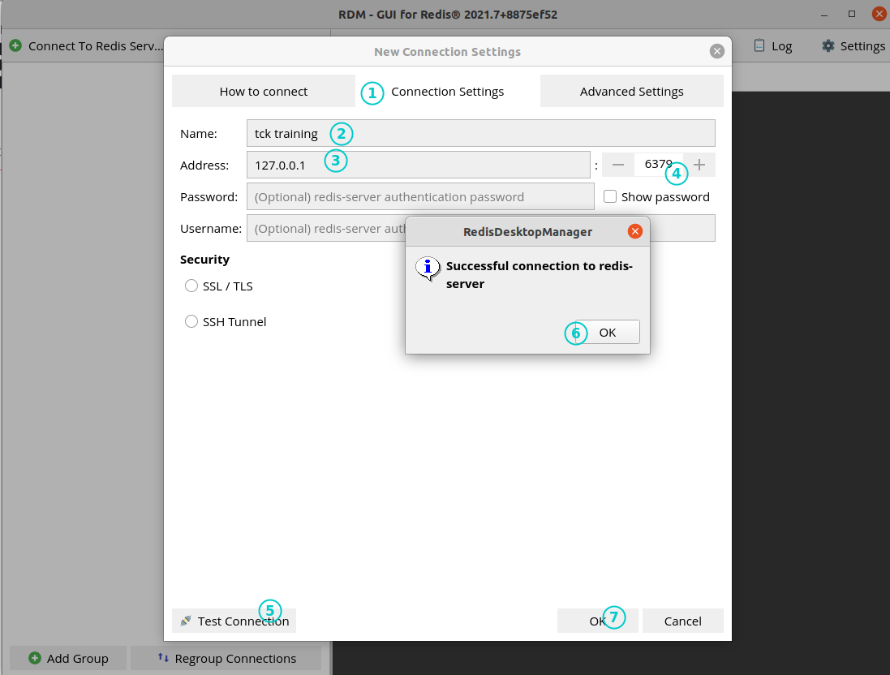
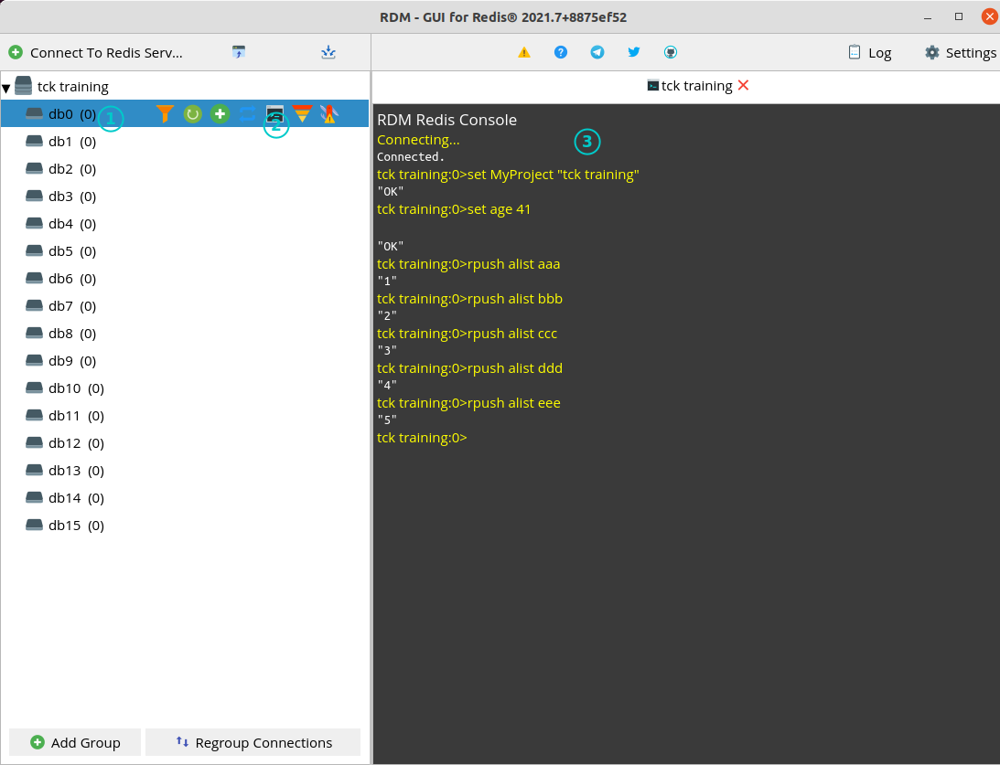
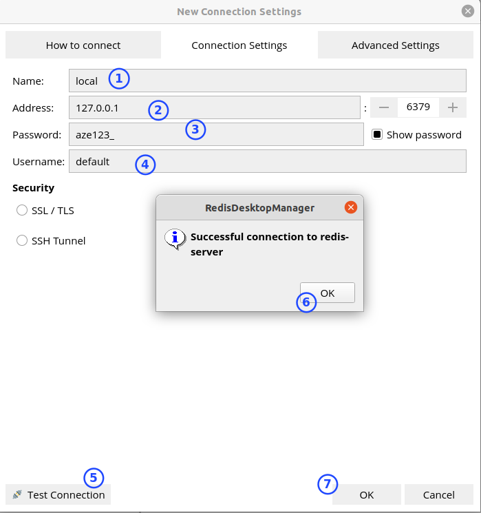

# Setup Redis back-end
Here are some steps to have a Redis database back-end locally.

## Start a Redis docker container
- Pull Redis 6.2.5 docker image from dockerhub
  - https://hub.docker.com/_/redis

```bash
$ docker pull redis:6.2.5
6.2.5: Pulling from library/redis
Digest: sha256:cd0c68c5479f2db4b9e2c5fbfdb7a8acb77625322dd5b474578515422d3ddb59
Status: Downloaded newer image for redis:6.2.5
docker.io/library/redis:6.2.5
```

- Start container with persistent storage

```bash
$ mkdir -p ~/redis/data
$ docker run --name redis-tck-training -p 6379:6379 -v ~/redis/data:/data -d redis redis-server --appendonly yes
d0e6bff28e67b3d27bdc89041768f327d51cfa3590976b0f6d8c9d71f9caf8a2
$ ls ~/redis/data/
appendonly.aof
$ docker ps | grep redis
d0e6bff28e67   redis   "docker-entrypoint.s…"   15 seconds ago   Up 14 seconds   6379/tcp   redis-tck-training
```

## Connect to Redis container with a gui client
I will use _Redis Desktop Manager_ (_RDM_) as graphical client to connect to the redis back-end:

```bash
$ sudo snap install redis-desktop-manager
```
Once it is installed you can launch it. There is currently no password defined. you just have to connect with '_localhost_' and port '_6379_':


and play with the default 16 databases (_db0_, _db1_, ..., _db15_):
- https://redis.io/topics/data-types-intro

I clicked on _db0_ then '_Open console_' and execute few commands. To see them clien on '_Reload keys in database_':


Great ! We have a functional Redis database !

## Setting container to define credentials

First, stop and delete current redis container:
```bash
$ docker stop redis-tck-training
```
$ docker rm redis-tck-training

As explained in dockerhub redis page, we have to define a _redis.conf_ file to define credentials
- https://hub.docker.com/_/redis
- https://redis.io/topics/security

Create the configuration file:
```bash
$ mkdir -p ~/redis/conf
$ echo "requirepass aze123_" > ~/redis/conf/redis.conf
$ echo "appendonly yes" >> ~/redis/conf/redis.conf
```

And run Redis again with this new conf:
```bash
$ docker run --name redis-tck-training -p 6379:6379 -v ~/redis/conf:/usr/local/etc/redis -v ~/redis/data:/data -d redis redis-server /usr/local/etc/redis/redis.conf
```

Then try to connect with RDM:



We now have a _Redis_ server with a login/password.
